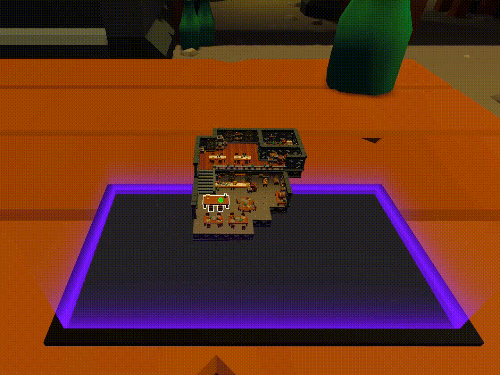

# Replico

Replico is a collaborative DeskVR approach designed to enhance communication and interaction in the analysis of 3D models. Using the world-in-miniature (WIM) metaphor and tactile controls to allow users to explore 3D models, create and discuss points of interest, Replico addresses common challenges in virtual collaboration, such as spatial referencing and awareness of other users’ activities.

[Dissertation Document](https://hdl.handle.net/10216/161052)

## Demonstration

[Replico Demonstration](https://youtu.be/ASTsTcqkwpc)

[Replico Tutorial](https://youtu.be/yuiG-FS3Arc)

## Actions

Actions in Replico are performed on a touch-sensitive surface. Users of Replico can use this surface to perform actions such as manipulating the world-in-miniature replica, creating points of interest, and teleporting around the 3D model.

### Replica Transformation

### Points of Interest

### Teleportation

